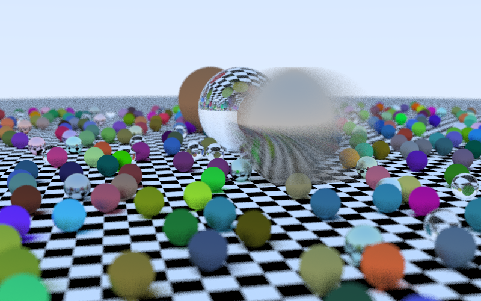

# raytracing-in-one-weekend

Rust implementation of the book "Raytracing in One Weekend" by Peter Shirley

Note: Old binaries might currently not work properly (/not even compile) as I haven't updated them after changing the library.

## Licenses
For all licenses, look into `license.html`.  
This file was automatically created using [cargo-about](https://github.com/EmbarkStudios/cargo-about) (Embark Studios).